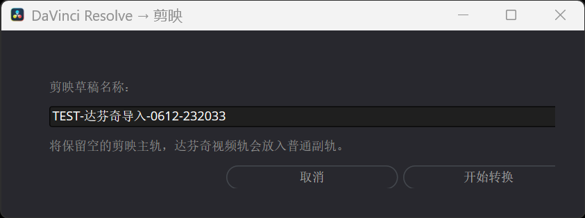

# 达芬奇时间线导入剪映 / DaVinci Resolve to Jianying

将 DaVinci Resolve 当前时间线转换为 Windows 剪映专业版可编辑草稿。
Convert the current DaVinci Resolve timeline into an editable Jianying Pro draft for Windows.

## 功能 / Features

- 从 Resolve 的 `Workspace > Scripts > Utility` 直接导出当前时间线。
- 保留视频、独立音频轨道、剪辑位置、源入点/出点和横竖屏画布。
- 根据 Resolve 真实链接关系处理视频原声，避免分离音频后重复发声。
- 支持 MP4 内分离音频，以及 WAV、MP3 等纯音频素材。
- 支持整段固定变速，并使用真实源时间保持画面入点。
- 将 Resolve 字幕轨转换为剪映字幕轨。
- 将 Resolve 灰色禁用片段转换为剪映真正的停用片段，可重新启用。
- 自动跳过无法等价转换的 Adjustment Clip，并显示跳过数量。
- 保留空的剪映主轨，防止 Resolve V1 被磁吸后错位。
- 支持基础缩放、位置、旋转、透明度和 9:16 时间线。

- Export the current Resolve timeline directly from `Workspace > Scripts > Utility`.
- Preserve video/audio tracks, edit positions, source ranges, and portrait or landscape canvases.
- Use Resolve's real linked-item relationships to prevent duplicate detached audio.
- Support audio detached from MP4 files and standalone WAV/MP3 assets.
- Transfer constant-speed retiming while preserving the visible source range.
- Convert Resolve subtitle tracks into Jianying subtitle tracks.
- Preserve disabled Resolve clips as real disabled Jianying clips.
- Skip unsupported Adjustment Clips and report the skipped count.
- Keep Jianying's magnetic main track empty to prevent V1 offsets.
- Transfer basic scale, position, rotation, opacity, and 9:16 timelines.

## 界面预览 / Interface Preview



## 环境要求 / Requirements

- Windows 10/11
- DaVinci Resolve 20 or 21
- Windows 剪映专业版 / Jianying Pro for Windows
- Python 3.8+（推荐 3.11/3.12）

## 安装 / Installation

1. 从 [Releases](../../releases) 下载最新 ZIP。
2. 解压完整 ZIP。
3. 双击 `安装.cmd` 或 `Install.cmd`。
4. 完全退出并重新启动 DaVinci Resolve。

Download the latest ZIP from [Releases](../../releases), extract it, run `安装.cmd` or `Install.cmd`, then restart Resolve.

## 使用 / Usage

1. 在 Resolve 中打开目标时间线。
2. 运行：

   ```text
   Workspace > Scripts > Utility > Current Timeline to Jianying
   ```

3. 输入剪映草稿名称并开始转换。
4. 转换完成后，在剪映草稿列表中打开新项目。

Open the target Resolve timeline, run the menu command above, name the Jianying draft, and open the generated project from Jianying's draft list.

## 转换限制 / Limitations

以下内容不能保证等价转换：

- Adjustment Clip（自动跳过并提示）
- 速度曲线、速度坡度、倒放和逐帧变速
- Optical Flow、Speed Warp 和帧混合算法
- Resolve 调色节点与 Fusion 合成
- 第三方插件、复杂转场和 Fairlight 音频效果

The following cannot be transferred exactly: Adjustment Clips, speed curves/ramps, reverse playback, Optical Flow, Speed Warp, color nodes, Fusion compositions, third-party plugins, complex transitions, and Fairlight effects.

## 卸载 / Uninstallation

运行 `卸载.cmd` 或 `Uninstall.cmd`。卸载不会删除已生成的剪映草稿。  
Run `卸载.cmd` or `Uninstall.cmd`. Existing Jianying drafts are preserved.

## 开源依赖 / Open-source Dependency

[pyJianYingDraft](https://github.com/GuanYixuan/pyJianYingDraft). Its license is included under `THIRD_PARTY_LICENSES/`.

## License

MIT
